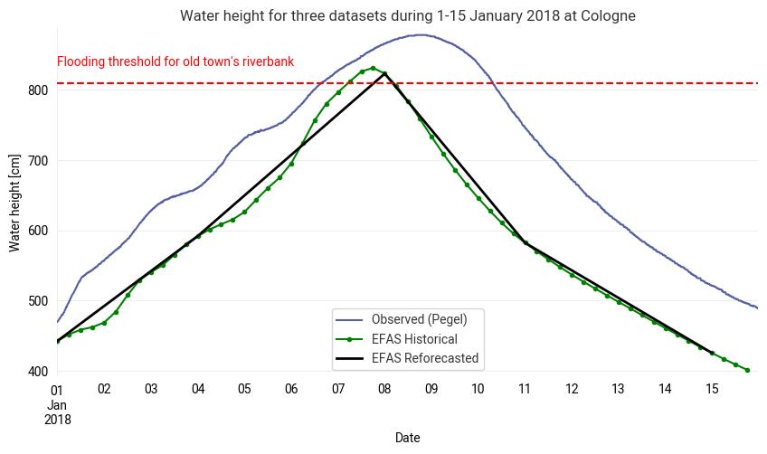

This notebook examines the January 2018 flooding of the oldtown of Cologne by inspecting and comparing three datasets: Local in-situ river water gauge (beloved Kölner Pegel), reforecasted and historical river discharge datasets from EFAS (European Flood Awareness System).

  
   
  <em>Main result of the study: Comparing water height during the flooding period calculated using different datasets.</em>

